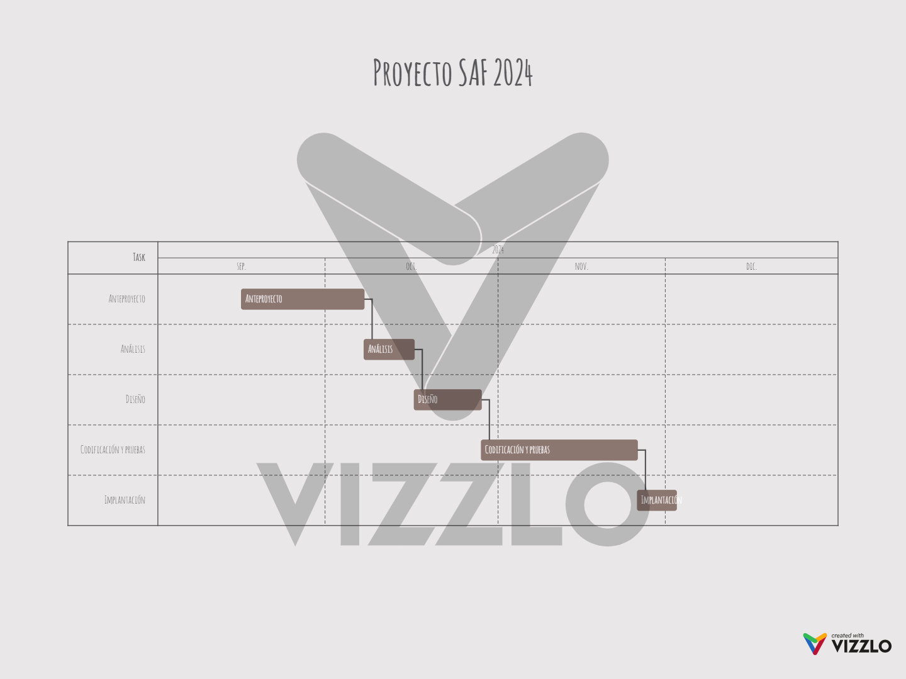

# Anteproyecto fin de ciclo

- [Anteproyecto fin de ciclo](#anteproyecto-fin-de-ciclo)
  - [1- Descripción del proyecto](#1--descripción-del-proyecto)
  - [2- Empresa](#2--empresa)
    - [2.1- Idea de negocio](#21--idea-de-negocio)
    - [2.2- Justificación de la idea](#22--justificación-de-la-idea)
    - [2.3- Segmento de clientes](#23--segmento-de-clientes)
    - [2.4- Competencia](#24--competencia)
    - [2.5- Propuesta de valor](#25--propuesta-de-valor)
    - [2.6- Forma jurídica](#26--forma-jurídica)
    - [2.7- Inversiones](#27--inversiones)
      - [2.7.1- Costes](#271--costes)
      - [2.7.2- Ingresos](#272--ingresos)
    - [2.8- Viabilidad](#28--viabilidad)
      - [2.8.1- Viabilidad técnica](#281--viabilidad-técnica)
      - [2.8.2 - Viabilidad económica](#282---viabilidad-económica)
      - [2.8.3- Conclusión](#283--conclusión)
  - [3- Requerimentos técnicos](#3--requerimentos-técnicos)
  - [4- Planificación](#4--planificación)

## 1- Descripción del proyecto

Este proyecto trata de una página web donde los usuarios tendrán la oportunidad de comprar libros e incluso adquirir un préstamo directamente a librerías 2ª mano de toda Galicia. Dichas librerías podrán gestionar sus propios productos y enviarse entre locales los libros que el usuario solicita hasta su tienda de confianza, beneficiándose mayormente de los pedidos de los clientes y de las suscripciones que soliciten.

## 2- Empresa

### 2.1- Idea de negocio

Nuestro portal desea ofrecer a las librerías de segunda mano un espacio web donde podrán gestionar sus productos de manera rápida y sencilla. De esta forma, los usuarios que visiten la página podrán explorar el catálogo de todas nuestras librerías afiliadas y realizar compras. Además, existe la posibilidad de que un libro sea enviado hasta la librería que el usuario elija, corriendo los gastos de envío a cargo del comprador, así podrá encontrar fácilmente su pedido en su tienda más cercana. 

Además de poder elegir entre un gran surtido de libros de nuestro catálogo, los usuarios tendrán la oportunidad de realizar un préstamo, pagando tan solo un pequeño porcentaje del precio total del producto seleccionado. También ofrecemos una tarifa mensual de suscripción donde los usuarios contarán con una serie de ventajas: gastos de envío gratis, un número limitado de préstamos gratuitos y descuentos a la hora de realizar compras. Gran parte de los beneficios de estas suscripciones serán destinadas a las librerías que deseen añadir estas ventajas a los productos de su comercio.

### 2.2- Justificación de la idea

La idea de realizar este portal web nace de una vivencia personal pues, como persona lectora, siempre estoy buscando una nueva lectura pero, la mayoría de las veces me encuentro con diversos problemas, ya sea porque en la biblioteca no cuenta con ejemplares disponibles o porque no me puedo permitir comprar comprar en librerías por falta de espacio o precio elevado. 
Es por este motivo que suelo recurrir a las librerías de segunda mano, las cuales ofrecen un precio mucho más económico. Sin embargo, el problema del espacio continua presente, fue entonces cuando se me ocurrió la idea de que dichas librerías contaran con un sistema de préstamos en el que tan solo fuese necesario pagar un pequeño importe con respecto al precio total de compra para que así pudiesen beneficiarse de ello. Pero me topé con el problema de que de estos negocios se encuentran bastante desperdigados por toda Galicia, por lo que no me es posible visitar frecuentemente todos ellos buscando un ejemplar en concreto que tal vez no esté disponible, fue entonces cuando la idea comenzó a adquirir forma:

¿Y si existiera una página web donde pudiéramos explorar el catálogo de todas estas librerías de manera rápida y cómoda?

Hoy en día estamos conectados a la red a todas horas por lo que, si estas librerías contasen con un espacio web donde ofrecer sus productos, tanto su rango de visibilidad como sus beneficios comenzarían a aumentar.

**Análisis DAFO**

-	Debilidades

Al tratarse de una empresa completamente nueva, es probable su crecimiento sea lento. Además, el tener que manejar tantos datos podría ser un problema si no se cuenta con una buena organización.
-	Amenazas

Existen algunas páginas como Relibrea o IberLibro, entre otros, que ya cuentan con su clientela habitual. También es posible que haya librerías que no deseen participar en esta iniciativa.
-	Fortalezas

La interfaz de nuestra web es cómoda y sencilla de entender para que todo el mundo pueda navegar por ella sin mayor complicación. 
Gracias al buen trato personal con una librería cercana, la dueña nos ha podido confirmar que varias librerías se verían interesadas en la plataforma, al igual que los clientes que frecuentan el local, afirmando que muchos lo utilizarían, lo que será muy útil para un mejor arranque a la hora de sacar el producto al mercado.
-	Oportunidades

Probabilidad de captar la atención tanto de posibles clientes como de usuarios, que ampliarían el rango de visibilidad de la web, la cual podría expandirse a nivel nacional en un futuro.

### 2.3- Segmento de clientes

El principal foco de clientes son los encargados de las librerías de segunda mano, a quienes ofrecemos sencillez y comodidad a la hora de gestionar sus libros en el portal, visualización del historial de compras y préstamos que los usuarios realizan para mayor organización y ampliación del rango de usuarios que tienen acceso a sus productos.

Por otra parte, los usuarios tendrán a su disposición una web desde la que visualizar de manera rápida y sencilla sus libros favoritos con la información correspondiente, así como saber en qué librería pueden encontrar el ejemplar deseado y realizar operaciones de caja de forma segura.

### 2.4- Competencia

Existen algunas empresas que podrían ocasionar dificultades a la hora de buscar el crecimiento de nuestra empresa por su posicionamiento establecido o servicios diferentes.

-	Relibrea

Una comunidad online donde los principales clientes son los usuarios de toda España, quienes pueden tanto comprar como vender libros de segunda mano.
Con más de 95.000 libros a la venta, ofrece un servicio gratuito y sin intermediarios para darle una segunda vida a tus libros de texto y de lectura.

-	IberLibro

Plataforma online para la compra y venta de libros, arte y artículos de colección que cuenta con vendedores independientes de todo el mundo. 
Es una subsidiaria de Amazon.com, inc con seis dominios internacionales y millones de libros y otros objetos de más de 50 países.

-	Libros & Co

Librería de 2ª mano con servicio de compra-venta online a un precio económico con un recorrido que comenzó en 2017 y con más de 600 comentarios en Google y altas valoraciones. 

### 2.5- Propuesta de valor

Este portal web ofrece a los usuarios fiabilidad y seguridad a la hora de realizar tanto compras como préstamos, ya que nuestras librerías afiliadas son las únicas que pueden ofrecer sus productos garantizando así su calidad.

A continuación destacamos algunas ventajas que ofrecemos:

-	Los usuarios podrían encontrar y adquirir un libro con gran facilidad y comodidad, ya que los libros de todas las librerías asociadas se mostrarán en un gran catálogo donde se indicará la procedencia de los mismos, algo bastante novedoso ya que englobamos muchas librerías en un solo sitio web.
-	Los clientes que contraten nuestro producto tendrán a su disposición la asistencia de los administradores, ya sea para solucionar cualquier problema y/o duda que tengan, como para enseñarles de manera clara y sencilla como gestionar sus libros en el portal.
-	Trabajando directamente con estos comercios, garantizamos la calidad de los libros y aseguramos la compra de los mismos, de esta manera los usuarios pueden estar tranquilos ante la probabilidad de ser víctimas de fraude, ya que esta práctica tiende a ocurrir en portales donde los propios usuarios venden sus productos.

Nuestro producto ofrece un servicio novedoso en el mercado, ya que no se trata del clásico portal de compra-venta que podemos encontrar por la web. Sino que cuenta con librerías colaboradoras de 2ª mano, procedentes del comercio local. 
Gracias a esto y a la inserción de nuestros clientes en la red, ayudaríamos a mejorar sus ganancias al mismo tiempo que ampliamos el rango de visibilidad.

Además, los usuarios verán atractivo en el sistema de suscripciones, donde ofrecemos múltiples ventajas como descuentos o envíos gratuitos. 

### 2.6- Forma jurídica

La forma jurídica escogida para esta empresa sería la de autónomos porque es la forma más sencilla y económica para emprendedores. Pese a que crear una empresa puede proyectar una imagen más profesional, también cuenta con varias limitaciones, mientras que como autónomos la constitución es más rápida y económica, sobre todo a la hora de empezar nuestro emprendimiento.

Contamos con dos líneas de ayuda, una de las cuales busca apoyar a las personas desempleadas al inicio de su actividad laboral con 2.000€, contando con una mayor subvención por pertenecer al colectivo de personas menores de 30 años, en total 4.000€, y un incremento total de un 30% de la cuantía base por cumplir con dos de los casos que se presentan, en este caso:

-	La persona incorporada es una mujer.
-	Profesiones y oficios en los que la mujer esté subrepresentada.

Por consiguiente, contaríamos con una ayuda inicial de 5.200€.

Por otra parte, la segunda línea ofrece 960€ a las personas desempleadas que se inicial como trabajadoras autónomas que ayudarían a costear los gastos de mantenimiento de la actividad.

En total, nuestra ayuda proveniente del programa para la promoción del empleo autónomo y la cuota cero de Galicia sería de 6.160€.

### 2.7- Inversiones

Algunas de las inversiones que debemos realizar al comienzo de nuestro emprendimiento se trata de la compra del mobiliario y el equipo necesarios para un trabajo óptimo:

-	Ordenador: 800€
-	Silla ergonómica: 250€
-	Mesa de trabajo: 260€

Por otra parte, de manera mensual debemos pagar una serie de suministros:

|         |     |
|---------|-----|
|Agua	    |30€  |
|Luz	    |60€  |
|Internet	|35€  |
|**Total**	  |**125€** |

#### 2.7.1- Costes

**Costes fijos**
-	Salario: 15.876€/año
-	Cotización: 950€/mes
-	Salario bruto: 27.276€
-	Host web(Incluye certificado SSL, nombre de dominio gratis por un año y otros servicios): 45€/año
-	Asesoría: 37€/mes 444

**Costes variables**
-	Marketing: 2000€
-	Servicio de paquetería (packlink pro/seur): 25€/mes
-	Otros gastos y reparaciones: 200€

|                 |        |
|-----------------|--------|
|Inversiones	    |1.500€  |
|Costes fijos	    |27.765€ |
|Costes variables	|2.500€  |
|**Total**	          |**31.765€** |

#### 2.7.2- Ingresos

Para calcular nuestros ingresos del primer año vamos a suponer que vendemos un
total de 9.000 ejemplares (entre compras y préstamos), que es el 50% de los
ejemplares vendidos en un año en Relibrea, teniendo en cuenta que habrá más
compras que préstamos y que una pequeña parte de estos usuarios adquieran una
suscripción.

- Precio medio de un libro: 8€
- Número de compras: 8.000 
- Precio medio del préstamo: 20% de 8=1,60€
- Número de préstamos: 1.000 
- Suscripción anual: 100€
- Usuarios con suscripción: 500

|               |         |
|---------------|---------|
|Compras	      |64.000€  |
|Préstamos	    |1.600€   |
|Suscripciones	|50.000€  |
|**Total**	        |**115.600€**|

En este caso, la empresa se quedaría con un 30% de las ganancias, a la que debemos restarle las cuotas de autónomo que, gracias a la cuota cero, será de 80€/mes durante el primer año (ampliable si nuestros ingresos se encuentran por debajo del SMI) y todos nuestros gastos, que serán mayores al tratarse del primer año debido a la compra del mobiliario.
Hay que tener en cuenta que el primer año no debemos contar con las ayudas para autónomo, ya que no suelen entrar en nuestras cuentas hasta pasado un año desde que las solicitamos.

|               |         |
|---------------|---------|
|Ganancias      |34.680€  |
|Cuota autónomo	|960€     |
|Gastos	        |31.765€  |
|**Total**	        |**1.955€**   |

**Umbral de rentabilidad**

Para calcular el umbral de rentabilidad primero debemos saber cuánto ganamos por libro vendido, ya que un libro puede costar 5, 8, 10 euros… vamos a colocar la media en 8. El 30% de 8 es igual a 2,4€ esto es lo que ganamos con cada uno de los libros vendidos.
Para conocer el número de libros que debemos vender para obtener beneficios es necesario dividir el total de gastos fijos entre nuestro margen de beneficio.

|                     |        |
|---------------------|--------|
|Gastos fijos         |27.765€ |
|Margen de beneficio	|2,4€    |
|**Número de libros**    |**11.250** |

Para que la empresa obtenga beneficios, necesitamos vender un total de 11.250 libros aproximadamente.

### 2.8- Viabilidad

#### 2.8.1- Viabilidad técnica

Contamos con todo lo necesario para la realización y el mantenimiento de dicho proyecto ya que el plan contratado para host nos proporciona muchas facilidades técnicas como servicio de soporte a cualquier hora o herramientas que nos garantizan la seguridad de nuestra web.

#### 2.8.2 - Viabilidad económica

Teniendo en cuenta que, con el tiempo, aumentaría la incorporación de más clientes al portal (con la probabilidad de que este se amplíe a nivel nacional), así como el uso del mismo por parte de los usuario, las ganancias aumentarían considerablemente.

#### 2.8.3- Conclusión

Tanto en la parte técnica, como económica, se demuestra que el producto es viable, siendo beneficioso para nuestros clientes y una novedosa incorporación en el mercado digital.

## 3- Requerimentos técnicos

La creación del producto necesitará, principalmente, un ordenador lo suficientemente potente como para poder programar y procesar
los datos de la web. Las tecnologías a usar serán: HTML para la estructura de la página, CSS para los estilos y la accesibilidad, 
phpmyadmin para la base de datos de los productos y los usuarios, PHP para la conexión de los datos sobre la página web y la conexión de los usuarios a sus cuentas con el plan que han contratado y javascript para procesar las compras y ventas de productos.

**Infraestructura**

- Dominio Web
- Host

**Front End**

- HTML
- CSS
- Javascript

**Back end**

- PHP
- SQL

## 4- Planificación

- Estudio preliminar: 2 semanas (7 de octubre)
- Análisis: 1 semana (16 de octubre)
- Diseño: 1 semana (28 de octubre)
- Codificación y pruebas: 1 mes (25 de noviembre)

**Diagrama de Gantt**

