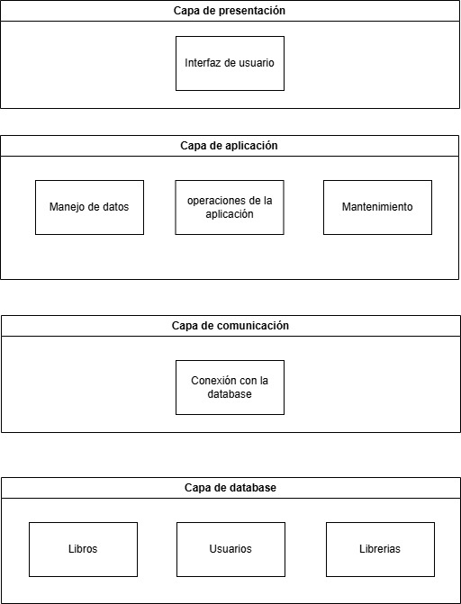
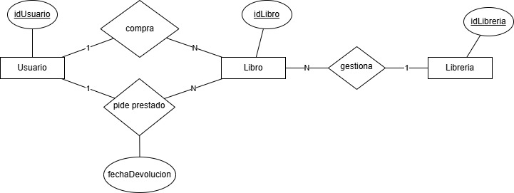
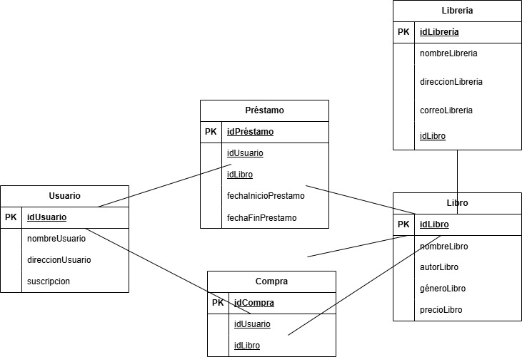

# FASE DE DESEÑO

- [FASE DE DESEÑO](#fase-de-deseño)
  - [1- Diagrama da arquitectura](#1--diagrama-da-arquitectura)
  - [2- Casos de uso](#2--casos-de-uso)
  - [3- Diagrama de Base de Datos](#3--diagrama-de-base-de-datos)
  - [4- Deseño de interface de usuarios](#4--deseño-de-interface-de-usuarios)

## 1- Diagrama da arquitectura

## 2- Casos de uso

## 3- Diagrama de Base de Datos
- Modelo Entidade/relación

- Modelo relacional

## 4- Deseño de interface de usuarios

Enlace al prototipo creado con Figma:

https://www.figma.com/design/FpzabBsJljr0lUQSKwWUoA/proyectoSAF?node-id=0-1&node-type=canvas&t=agDEgWi5G4eyGWaa-0